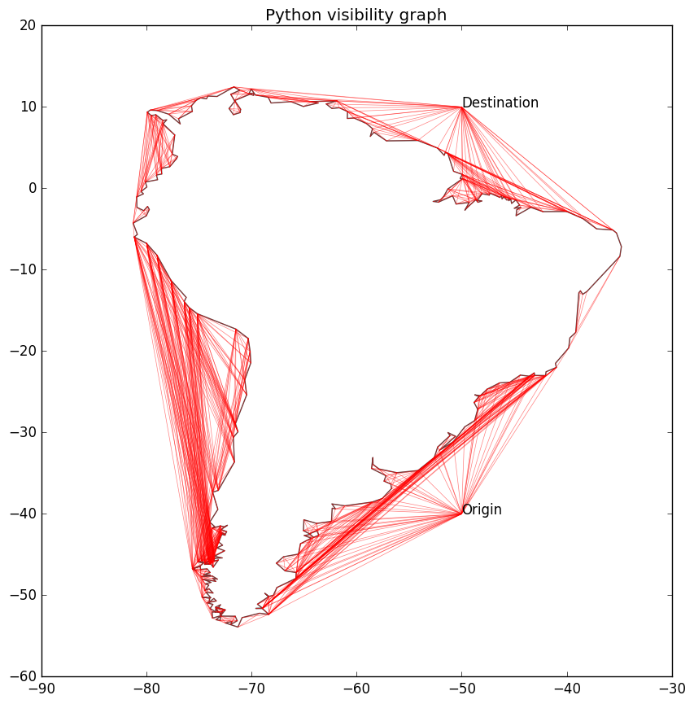

# Pyvisgraph - Python Visibility Graph

[](/LICENSE.txt)


Given a set of simple obstacle polygons, build a visibility graph and find
the shortest path between two points.



Pyvisgraph is a MIT-licensed Python package for building visibility graphs from
a set of simple obstacle polygons. The visibility graph algorithm (D.T. Lee)
runs in O(n^2 log n) time. The shortest path is found using Djikstra's
algorithm.


## Installing Pyvisgraph
```
$ pip install pyvisgraph
```

## Usage
Here is an example of building a visibility graph given a list of
simple polygons:
```
>>> import pyvisgraph as vg
>>> polys = [[vg.Point(0.0,1.0), vg.Point(3.0,1.0), vg.Point(1.5,4.0)],
>>>          [vg.Point(4.0,4.0), vg.Point(7.0,4.0), vg.Point(5.5,8.0)]]
>>> g = vg.VisGraph()
>>> g.build(polys)
>>> shortest = g.shortest_path(vg.Point(1.5,0.0), vg.Point(4.0, 6.0))
>>> print shortest
[Point(1.50, 0.00), Point(3.00, 1.00), Point(4.00, 6.00)]
```
Once the visibility graph is built, it can be saved and subsequently loaded.
This is useful for large graphs where build time is long. `cPickle` is used
for saving and loading.
```
>>> g.save('graph.pk1')
>>> g2 = VisGraph()
>>> g2.load('graph.pk1')
```
For obstacles with a large number of points, Pyvisgraph can take advantage of
processors with multiple cores using the `multiprocessing` module. Simply
add the number of workers (processes) to the `build` method:
```
>>> g.build(polys, workers=4)
```
Pyvisgraph also has some useful helper functions:
* `g.update([list of Points])`: Updates the visibility graph
  by checking visibility of each `Point` in the list.
* `g.point_in_polygon(Point)`: Check if `Point` is in the interior of any of
  the obstacle polygons. Returns the polygon_id of said polygon, -1 if not
  inside any polygon.
* `g.closest_point(Point, polygon_id)`: Return the closest point outside
  polygon with polygon_id from Point.

## Performance
Using a shapefile representing world shorelines, Pyvisgraph has the following
performance on a Microsoft Surface Pro 3 (Intel i7-4650U@1.7Ghz, 8GB DDR3 RAM),
where time is in seconds:
```
Shoreline obstacle graph [points: 4335 edges: 4335]
Using 4 worker processes...
Time to create visibility graph: 554.683238029
Visibility graph edges: 118532
Time to update visgraph & find shortest path: 1.09287905693
Shorest path nodes: 19
Time to find shortest path between existing points: 0.508340835571
```

For more information about the implementation, see these series of articles:
* [Distance Tables Part 1: Defining the Problem](https://taipanrex.github.io/2016/09/17/Distance-Tables-Part-1-Defining-the-Problem.html)
* More to come...
